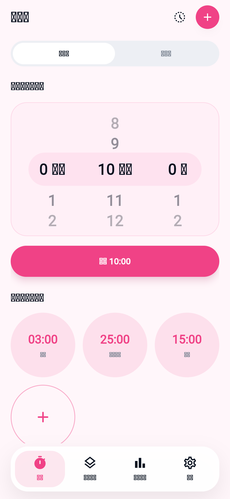
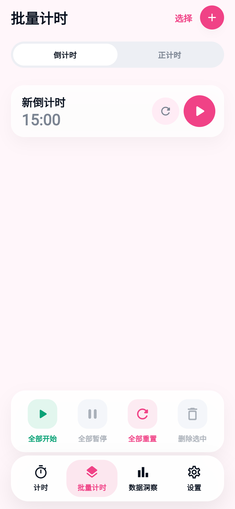
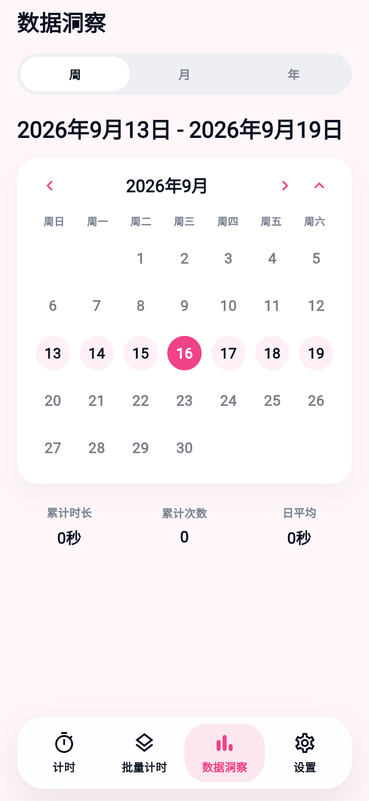
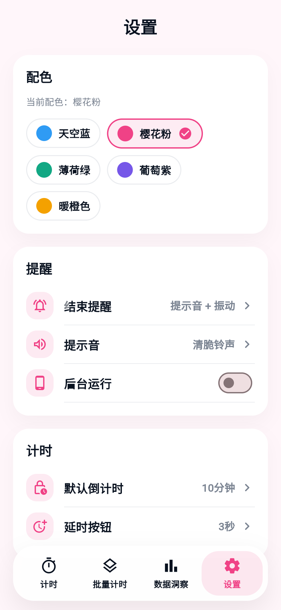

# Timer App 计时器

一款基于 Flutter 的学习/专注计时应用，内置常用倒计时预设、批量秒表计时、计时统计与历史记录，数据全部保存在本地。应用主定位是学习与专注，刷牙、运动等场景作为可编辑预设使用，不扩展成强联网的通用任务平台。

## 功能特性

- **倒计时**：内置「刷牙」「番茄时钟」「练字」等常用预设，支持全局默认时长、自定义时长与全屏聚焦页面，结束后播放提示音并回到初始时长。
- **批量计时**：同时管理多个计时项，支持倒计时与秒表两种模式、卡片多选与批量启停。
- **标签管理**：为秒表计时自定义标签（如「口算」「阅读」「运动」「学习」），支持新增、重命名、删除，并禁止创建重复标签。
- **统计洞察**：以可折叠日历回顾每天的计时情况，并按计时项/标签汇总时长与次数。
- **历史记录**：保存完成的倒计时，以及退出时保存的正计时记录。
- **个性化设置**：多套配色主题、提示音开关、默认倒计时时长与延时按钮配置。
- **后台提醒**：首页和批量倒计时分别调度本地结束通知；Android 可在设置中开启前台服务增强后台运行稳定性。
- **本地存储**：通过 SQLite（sqflite）持久化，无需登录、无需联网。

## 界面截图

| 计时首页 | 批量计时 |
| --- | --- |
|  |  |

| 数据洞察 | 设置 |
| --- | --- |
|  |  |

## 行为规则

- **历史记录**：倒计时在自然结束后写入历史；正计时在用户确认退出时写入历史。未开始或 0 秒正计时不会写入无意义记录。
- **默认倒计时**：设置页里的默认倒计时时长会影响首页倒计时滚轮、创建倒计时页面、批量计时添加倒计时弹层。
- **默认预设**：内置倒计时和内置标签可以删除；删除后会隐藏，不是永久移除系统模板。
- **标签去重**：新增或修改标签时，不能和当前可见的默认标签、自定义标签重复。
- **统计口径**：数据洞察统一使用历史记录的名称字段汇总，因此倒计时名称和正计时标签都会参与“计时项/标签”统计。
- **日历折叠**：数据洞察日历的折叠状态只在当前页面会话内保留，暂不写入持久化设置。
- **计时准确性**：首页计时与批量倒计时按时间戳计算进度，回到应用后会校正显示时长。
- **批量倒计时提醒**：每个计时项独立提醒；暂停、重置或删除某一项只撤销对应提醒。通知或精确闹钟权限不可用时，计时页面会提示提醒可能缺失或延迟。

## Android 通知权限

结束提醒开启时，应用会在首页显示后请求通知权限，开始倒计时也会检查该权限。Android 13 及以上在尚未授权时可显示系统授权弹窗；Android 12 及以下没有这一运行时权限弹窗。不需要精确闹钟权限也能发通知；精确提醒的授权会在需要时单独请求，未授权时降级为可能延迟的普通调度。

如果以前拒绝过通知或系统不再弹出授权窗口，请长按应用图标进入“应用信息 → 通知”，允许通知，并检查声音、振动及悬浮通知设置。小米/红米手机锁屏或后台提醒仍受系统省电策略影响；需要后台提醒时，请同时检查自启动和电池限制。

通知使用专用的单色 `drawable/ic_stat_timer` 图标，与桌面图标分开；`res/raw/keep.xml` 保留动态引用的图标，避免 Release 资源压缩导致通知初始化失败。

## 快速开始

环境要求：Flutter 3.22+（Dart 3.4+）。

```bash
# 安装依赖
flutter pub get

# 运行（连接设备或启动模拟器后）
flutter run

# 运行单元测试
flutter test

# 构建 Android Release APK
flutter build apk --release
```

Release APK 默认输出到：`build/app/outputs/flutter-apk/app-release.apk`。

## 自动发布 Android 安装包

每次推送到 `main`，GitHub Actions 会执行代码检查、测试和 Release APK 构建，成功后更新固定的 [`latest` Release](https://github.com/mytechdream/timer-app/releases/tag/latest)。下载链接为 [timer-app-latest.apk](https://github.com/mytechdream/timer-app/releases/download/latest/timer-app-latest.apk)，同时提供 SHA-256 校验文件。

发布流程见 [android-release.yml](.github/workflows/android-release.yml)。也可以在 [Actions 页面](https://github.com/mytechdream/timer-app/actions/workflows/android-release.yml)选择 `main`，点击 **Run workflow** 手动运行。较早提交的构建如果发现 `main` 已有新提交，会跳过发布，由新提交更新安装包；历史版本 Release 继续保留。

APK 版本名称取自 `pubspec.yaml`，构建号为其中的基础构建号加上工作流运行序号。例如 `1.1.0+2` 在首次自动构建时生成 `1.1.0+3`，后续运行递增。更新 `pubspec.yaml` 时，基础构建号应保持递增。

自动构建通过仓库 Secret `ANDROID_DEBUG_KEYSTORE_BASE64` 复用现有安装包的签名密钥。工作流将密钥解码到临时文件，并通过 `ANDROID_SIGNING_KEYSTORE_PATH` 显式传给 Gradle，发布前会校验 APK 签名，保证已安装版本可以覆盖升级。Secret 内容是现有 `debug.keystore` 的 Base64 编码，密钥文件不提交到仓库。迁移仓库或更换构建环境时，需要在 **Settings → Secrets and variables → Actions** 配置同名 Secret。

## 项目结构

```
lib/
├── main.dart            # 应用入口
├── app/                 # 根组件与全局状态
├── data/                # 数据仓库（SQLite / 内存实现）
├── models/              # 数据模型与默认预设
├── pages/               # 各页面（计时、批量、统计、历史、创建、设置）
├── services/            # 提示音等服务
├── theme/               # 主题与配色
├── utils/               # 工具函数
└── widgets/             # 通用组件
```

## 反馈

如有问题或功能建议，欢迎反馈：1838492264@qq.com。

## 已知限制

- 当前不支持账号登录、云备份或跨设备同步。
- 核心计时、历史记录和统计能力均以本地数据为准。
- Android 开启“后台运行”后会尝试使用前台服务，并同时调度本地通知；系统省电策略、权限和厂商限制仍可能影响后台表现。
- iOS 使用时间戳恢复计时和本地通知，不保证应用被系统强制终止后继续保持页面状态。
